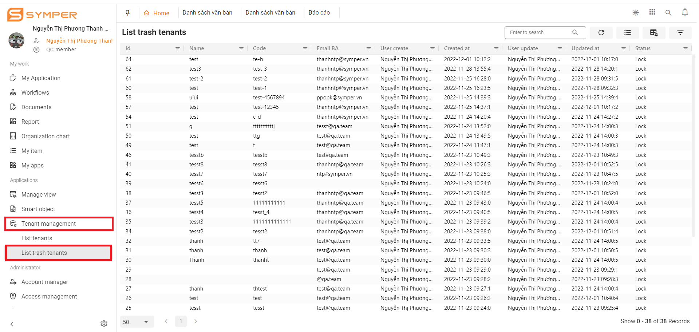

# Issue Tracking

## Biểu mẫu đối tượng

## Cách sử dụng

* Bước 1: Vào Ứng dụng của tôi trên hệ thống của Symper -> click chọn Quality Control -> Click chuột phải vào quy trình SYMPER BUG TRACKING -> chọn Bắt đầu

.png>)

* Bước 2: Nhập các giá trị bắt buộc:

.png>)

Sau khi chọn Sub Module ID thì tên QC và Dev phụ trách sẽ hiện ra.

Nhập nội dung mô tả bug, gắn video minh họa (nếu có) vào phần Mô tả.

Bước 3: Gửi task và ấn hành động Áp dụng hoàn thành với task vừa gửi.

Task được gửi đi sẽ hiện trên danh sách bản ghi của document.

Bước 4: Theo dõi bug và re-test lại sau đó sửa trạng thái cho bug.

* Nếu Re-test lại bug đã được sửa đúng -> đóng bug -> chuyển trạng thái DONE.
* Nếu Re-test lại bug chưa được sửa đúng -> re-open bug -> chuyển trạng thái RE-OPEN.
