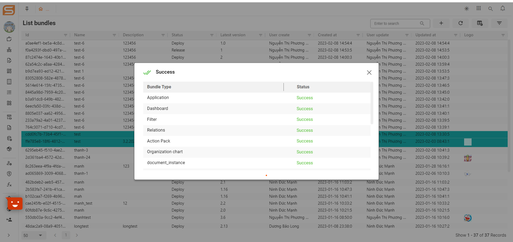
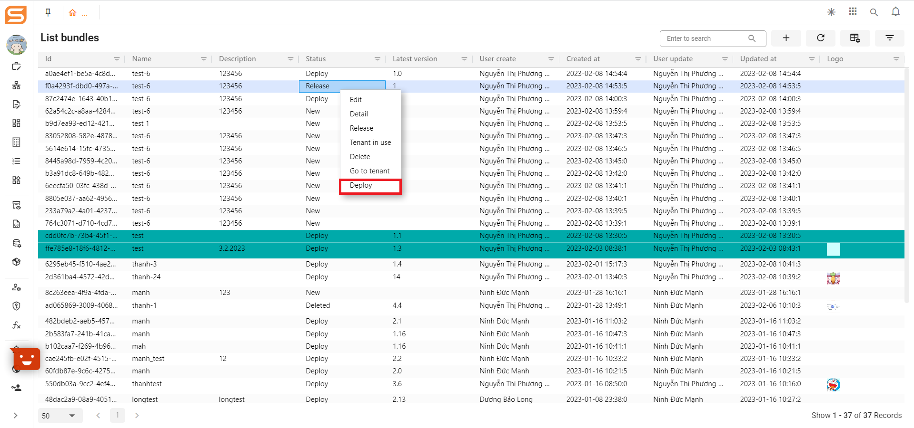

# Bundle management

## OVERVIEW

Bundle management: A collection of applications to deploy to the desired tenant.

BA can select the created bundle and release the bundle, when released, the bundle can be deployed to other tenants, and the status of the bundle is from New -> Released. Deployed bundles cannot be re-released.

BA chooses a plan to deploy to your other or primary tenant, and BA chooses tenants to deploy via tenant (can only deploy one package per deployment)

## HOW TO ACCESS TO BUNDLE MANAGEMENT ON THE SYSTEM

**Step 1**. Log in to the system

**Step 2.** Click on the menu sidebar => Click on _"_**Bundle management**_**"**_

<figure><figcaption></figcaption></figure>

## HOW TO CREATE ONE BUNDLE MANAGEMENT

To create one bundle, we follow the steps below in turn:

**Step 1**. Log in to the system => Click on the menu sidebar

**Step 2**. Select “**Bundle management**” => Click on _"_**List bundles**_"_

**Step 3**. After the screen shows the list of bundles, click “**Add**”

**Step 4**. Fill in the required information in General information and Application tap (Information fields are assigned a red asterisk)

<figure><figcaption></figcaption></figure>

**Step 5**. Click “**Save**” to finish creating new Bundle management

## HOW TO RELEASE ONE BUNDLE MANAGEMENT

When releasing a bundle, two scenarios occur:

1. Release the bundle for the first time.
2. Release the bundle for the next time.

### 1. To release the bundle for the first time, we follow the steps below in turn:

**Step 1**. Create one the bundle (prerequisites)

**Step 2**. Right-click on bundle record whose status is New => Click the Release button

<figure><figcaption></figcaption></figure>

**Step 3**. Fill in the required information (Information fields are assigned a red asterisk)

<figure><figcaption></figcaption></figure>

_**Note:**_ Email account BA must exist only in Database

**Step 4**. Click “**Release**” to release Bundle management

After clicking the Release button, a popup will appear showing the progress and showing the release status.

<figure><figcaption></figcaption></figure>

### 2. To release the bundle for the next time, we follow the steps below in turn:

**Step 1**. Create one the bundle (prerequisites)

**Step 2**. Right-click on any bundle record => Click the Release button

**Step 3**. Fill in the required information (Information fields are assigned a red asterisk)

<figure><figcaption></figcaption></figure>

_**Note:**_ When releasing the bundle for the next time, the version of the bundle mustn't same as the version of the bundle at the previous release.

**Step 4**. Click “**Release**” to release Bundle management

After clicking the Release button, a popup will appear showing the progress and showing the release status. The latest version will be updated on the show list of the bundle.

## HOW TO DEPLOY ONE BUNDLE MANAGEMENT

**Step 1**. Create and release the bundle (prerequisites)

**Step 2**. Right-click on any released bundle record  => Click the Deploy button

<figure><figcaption></figcaption></figure>

**Step 3**. Deploy bundle for the tenant

<figure><figcaption></figcaption></figure>

1. Select the tenant to deploy the bundle
2. Click on the icon Setting => Show list objects of the selected tenant
3. Tick on Objects to deploy the bundle
4. Click on the Deploy button
5. After clicking the Deploy button, a popup will appear showing the progress and showing the deploy status. The deploy status will be updated on the show list of the object tenants.

In addition, we can see the list of tenants using the bundle and go to the tenant of that bundle.
