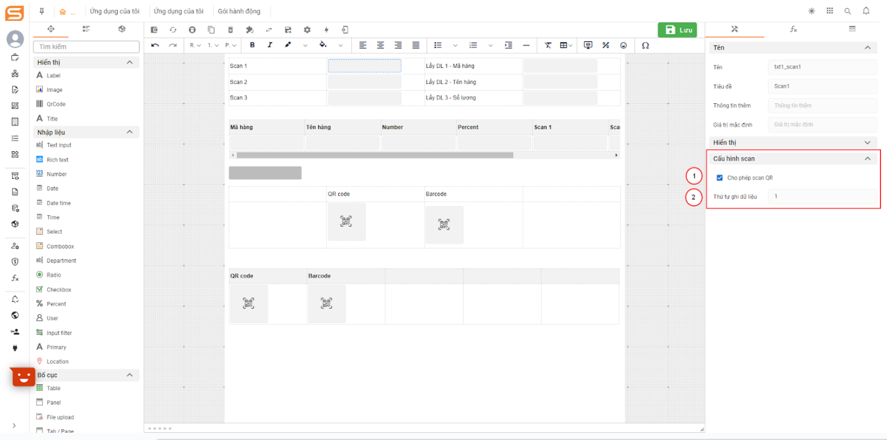

# Cross tenant

## Config the tenants that push data through each other and store the docs to have the same structure

1. Prerequisites: Tenants must have a common document structure
2. Steps to config side throw

* Config node throw signal:

\+ Config pass signal name (JUEL): Can config in variable or default form

&#x20;Config in the variable: ${id node want to throw data\_nam variable in doc}

&#x20;Config default form: Ex: symper

.png>)

\+ When you want to do the cross-tenant, you must check the 'Bất đồng bộ' and 'Bắn sang tenant khác' checkboxes.

\+ Config signal parameter prefix: The purpose is to determine the variable name passed from another tenant in case the variable name in the destination tenant and the source tenant are the same.

\+ Select node to throw data

\+ Config name variable for data of the node: The purpose is to encapsulate the data of the document that wants to throw cross tenant with a variable.

&#x20;    &#x20;
