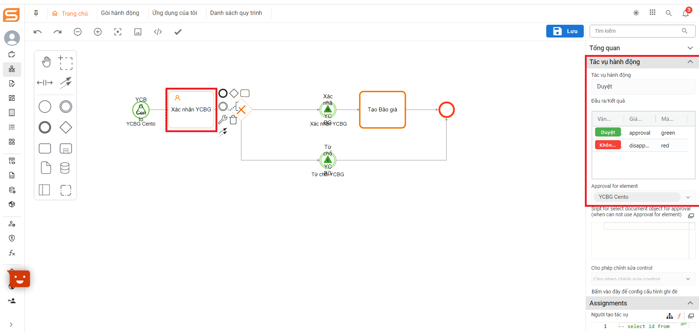

# Cross tenant

## Config the tenants that push data through each other and store the docs to have the same structure

1. Prerequisites: Tenants must have a common document structure
2. Steps to config side throw

* Config throw signal event:

\+ Config pass signal name (JUEL): Can config in variable or default form

&#x20;Config in the variable: ${id node want to throw data\_nam variable in doc}

.png>)

&#x20;Config default form: Ex: symper

.png>)

\+ When you want to do the cross-tenant, you must check the 'Bất đồng bộ' and 'Bắn sang tenant khác' checkboxes.

\+ Config signal parameter prefix: The purpose is to determine the variable name passed from another tenant in case the variable name in the destination tenant and the source tenant are the same.

\+ Select node to throw data

\+ Config the variable name for data of the node: The purpose is to encapsulate the data of the document that wants to throw cross tenant with a variable.

\+ Config the variable name you want to pass along: Include variables generated in the workflow, configured as follows: id node\_name variable. In case more than a variable is passed, the variables are separated by a comma.

\+ For each throw signal event, there will be a corresponding signal prefix in the form of a character string.

<figure><figcaption></figcaption></figure>

3. Config side catch

* Config catch signal event

\+ Config pass signal name (JUEL): Only config one style is left as default. If the party throw catch config is in a variable form, then the BA needs to determine the output of that variable and enter the default type.

\+ The prefix signal: Enter the signal prefix name of the throw signal event on the source tenant.

* Config user task node

\+ Under 'Get from another tenant': you must check the 'Duyệt liên tenant' checkbox.

\+ Config the variable name for data of the node: Follow form:  signal parameter prefix side throw\_the variable name for data of the node side throw.

\+ Select the document to save data: Select a document with the same structure as the document on the tenant throws side to save data.

<figure><figcaption></figcaption></figure>

## Perform cross-tenant browsing

The browsing config is similar to the config for saving data, but with more additions: For the User task node when the action is browsed then the User task config selects Approval for elements →select catch signal event.

Users assigned to cross-tenant task browsing will receive the browsing task in their My item section

<figure><figcaption></figcaption></figure>

## Granting permissions for cross-tenant access

Performing permissions allocation similar to when assigning permissions to other objects such as apps, documents, ... .

In the document permissions section of the action pack, add permission action: Sharing cross tenants.

Check the corresponding cross-tenant sharing checkbox next to each document that is allowed to be shared.

<figure><figcaption></figcaption></figure>

After completing cross-tenant sharing permissions allocation, to grant permission for viewing detailed records of the shared documents, select Action pack -> In the object type section on the left-hand side of the action pack, choose the "Cross-Tenant Sharing" tab -> Check the "View Cross-Tenant Data" checkbox for permission allocation.

<figure><figcaption></figcaption></figure>
