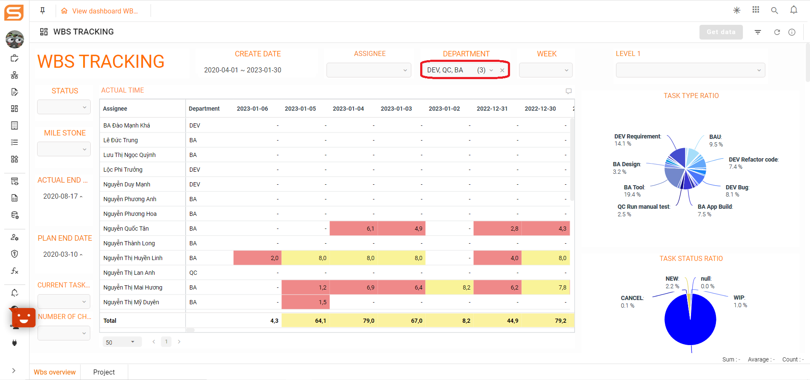

# Dashboard data launch filter

## OVERVIEW

When the filter config is initialized, initially the dashboard shows no data. The user needs to configure the filter data and activate the Get Data button to display the filter data.

Users need to click activate every time the data is filtered to get new data for the charts.

When the user configures the default filter and the filter initializes, the default filter is preferred.

## DEFAULT FILTER **CONFIG**

**Step 1:** In the edit/view screen dashboard, select the icon on the menu bar to open the right sidebar. Click on Add button

<figure><figcaption></figcaption></figure>

**Step 2:** After clicking the Add button, the user selects the filter condition, gives the filter a name, and Saves the filter config

<figure><figcaption></figcaption></figure>

**Step 3:** Default filter configuration

<figure><figcaption></figcaption></figure>

1. Click on icon 
2. Click on the icon Setting inside the title filter
3. Click on default

## AUTOMATICALLY FILTER DATA **CONFIG**

**Step 1:** Check automatically filter data

1. Hover on the bottom panel tab
2. Tick 'Automatically filter data' on the checkbox

<figure><figcaption></figcaption></figure>

**Step 2:** The user selects the filter condition, and clicks the 'Get data' button

<figure><figcaption></figcaption></figure>

## Additional information

* The user can configure a combination of the default and initializer filters.
* The first time you enter the dashboard, the charts will have no data, you only get the data after you click to run the filter - There is a notice in the charts that there is no data, and you need to filter to get the data.
* When the dashboard has many tabs, the config filter will display each configured tab, not the whole dashboard.

## Remove filter value in chart filter

1. In the case of filtering 1 value

&#x20;Click the X icon next to the value to clear the filter condition

<figure><figcaption></figcaption></figure>

2\. In the case of filtering multiple values

<figure><figcaption></figcaption></figure>

* When clicking on icon X, will delete all the filters.
* When deleting each value, click the filter to deselect the value you want to remove.

## Configure the condition filter in the control panel

### Overview

Use some keywords as the default filter condition. For example TODAY - The current date value. CURRENT\_USER - Value according to the login account.

Steps:

1. Click on the filter icon in the upper right corner of the chart

<figure><figcaption></figcaption></figure>

2\. Click on the value filter field

<figure><figcaption></figcaption></figure>

3\. Select filter conditions and enter keywords

<figure><figcaption></figcaption></figure>

4\. Click on the button Apply

