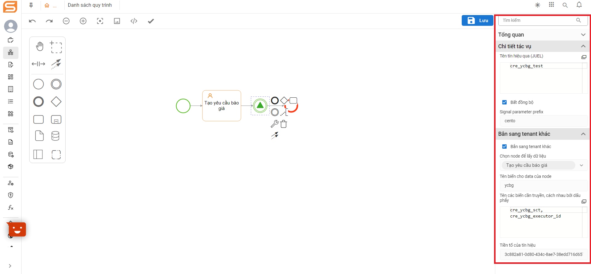

# Tenant management

## OVERVIEW

Tenant management: A unique address of an entity usable and operating on the Symper system platform.

For example: Company A when using the Symper system will be provided with a separate tenant to operate and store data on that tenant.

## HOW TO ACCESS TO TENANT MANAGEMENT ON THE SYSTEM

**Step 1**. Log in to the system

**Step 2.** Click on the menu sidebar => Click on _"_**Tenant management**_**"**_

<figure><figcaption></figcaption></figure>

## HOW TO CREATE ONE TENANT MANAGEMENT

To create one tenant, we follow the steps below in turn:

**Step 1**. Log in to the system => Click on the menu sidebar

**Step 2**. Select “**Tenant management**” => Click on _"_**List tenants**_"_

**Step 3**. After the screen shows the list of tenants, click “**Add**”

<figure><figcaption></figcaption></figure>

**Step 4**. Fill in the required information (Information fields are assigned a red asterisk)

<figure><figcaption></figcaption></figure>

**Step 5**. Click “**Save**” to finish creating new Tenant management

## LOGIC OF THE TENANT MANAGEMENT

### 1. Activate the Tenant

<figure><figcaption></figcaption></figure>

<figure><figcaption></figcaption></figure>

### 2. Inactivate the Tenant

When a tenant is locked, the user who logs in to the tenant via the tenant's URL will display a message that your tenant is locked to the user

<figure><figcaption></figcaption></figure>

### **3. Delete the Tenant**

A tenant can be deleted, when the tenant is deleted (the system will ask to confirm for the BA before wanting to delete) the BA can undo the deletion of the tenant by going to the recycle bin to reactivate. End users will not be able to access the deleted tenant

<figure><figcaption></figcaption></figure>

